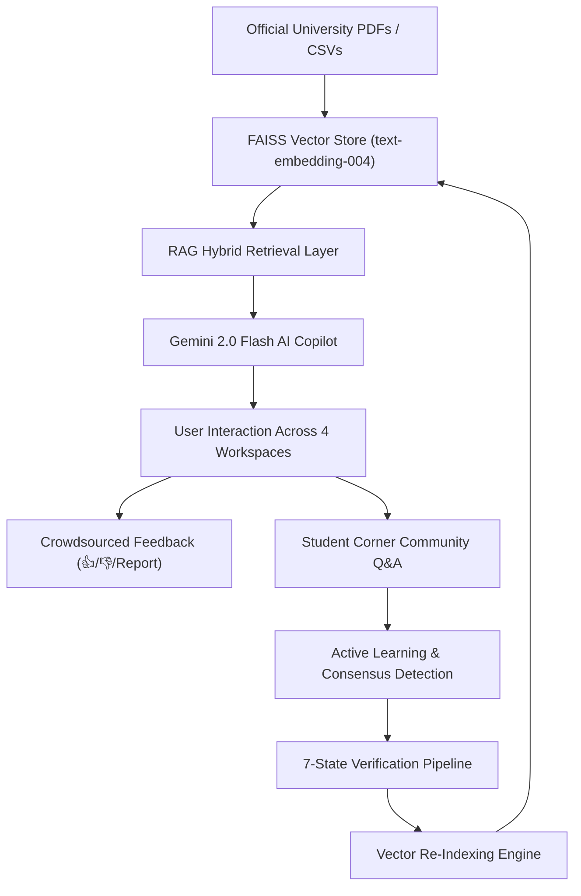

# MAHE MIT CampusOS — Enterprise University Digital Operating Platform 🏛️🤖

[](frontend/)
[](backend/)
[](backend/)
[](backend/)
[](backend/)
[](LICENSE)

An enterprise-grade **University Digital Operating Platform & Institutional Intelligence Engine** for **Manipal Academy of Higher Education (MAHE MIT Manipal)**. 

**MIT CampusOS** bridges official university documents (Calendars, Admission Cutoffs, Faculty Directories) with student community wisdom and AI intelligence through an **11-Stage Closed-Loop Knowledge Flywheel**.

---

## 🌟 Key Platform Pillars

### 1. 4 Stakeholder-Specific Workspaces
- 🎓 **Student Dashboard (`StudentCorner.jsx`)**: Personalized greeting (*"Welcome back, Aarav! (CSE 3rd Year)"*), upcoming academic events, important notifications, Student Corner preview across 11 sub-channels, trending campus discussions, personalized branch recommendations, and reputation portfolio summary (1,240 Campus Points).
- 👨‍🏫 **Faculty Dashboard (`FacultyPortal.jsx`)**: Academic syllabus schedules, grade submission deadlines, AB5 cabin directory lookup (Dr. Radhika Pai, Dr. Somanath), research grant applications, and candidate knowledge submission for RAG vector index ingest.
- 👨‍👩‍👧 **Parent & Admissions Hub (`ParentHub.jsx`)**: Mandatory 75% attendance policy alert cards, academic calendar milestones, tuition fee payment deadlines, and campus safety bulletins.
- 👑 **Admin Console (`AdminPortal.jsx`)**: 11-Stage Knowledge Loop diagram, RAG doc re-indexing manager, user account directory, 7-state verification table, content moderation console, and real database analytics.

### 2. Verified RAG Vector Engine & Structured Trust Cards
- **Grounded Vector Search**: Semantic search over official institutional PDFs/CSVs using `FAISS` and Google `text-embedding-004` (768 dimensions).
- **Structured Trust Metadata Card**:
  ```
  Your registration deadline is tomorrow at 5:00 PM.
  ───────────────────────────────────────────────────
  📄 Source:       Academic Calendar 2026–27.pdf
  🟢 Confidence:   High (Official Source Confirmed)
  🎯 Relevant for: 7th Semester • Computer Science & Engg
  [View Source 🔍]
  ```
- **4 Confidence Level Guardrails**: Explicit uncertainty disclaimers for `low` or `no_evidence` responses (*"I couldn't find reliable official information about this in university documents."*).
- **Clickable `[View Source 🔍]` Action Button**: Launches the **Source Inspector** drawer directly focused on PDF page text snippets and vector similarity match scores.

### 3. Student Corner Community & Reputation Gamification
- **11 Sub-Community Channels**: Reddit-style Q&A discussions (`Academics`, `Hostel & Mess`, `Facilities & Printing`, `Festivals & TechTatva`, `Placements`, `Projects`, etc.).
- **Accepted Helpful Answer Verification**: Post creators mark helpful student answers (+25 points).
- **Reputation Portfolio & Badges**: 7 unlockable badges (`Helpful Senior`, `Campus Guide`, `Knowledge Contributor`, `Problem Solver`, `Top Contributor`, `Freshman Helper`, `Verified Contributor`) and multi-period leaderboards (`Weekly`, `Monthly`, `All-Time`).

### 4. 7-State Verification Pipeline & Active Learning
- **7-State Taxonomy**: `Official`, `Community`, `Pending Verification`, `Verified`, `Conflicting`, `Outdated`, `Deprecated`.
- **Conflicting Information Handler**: Displays warning banners (`⚠️ Conflicting Information Warning: Student reports indicate entry gate closes at 9:15 PM`) without overwriting official truth.
- **Active Learning Engine**: Automatically detects high-consensus student community answers and routes them for admin verification & vector store re-indexing.

### 5. Multi-Category Notification Center Drawer
- **5 Notification Categories**: `Academic 🎓`, `Administrative 🏛️`, `Community 💬`, `AI/Knowledge 🧠`, `Personalized 🎯`.
- **4 Priority Indicators**: 🔴 **Important**, 🟡 **Reminder**, 🔵 **Community**, 🟢 **Achievement**.
- **Interactive Alarm Reminders**: Toggle calendar event alarms with one click (`Alarm Set ⏰`).

### 6. Global Multi-Domain Search Engine
- **Keyboard Shortcut**: Instant `Cmd + K` (Mac) / `Ctrl + K` (Windows) search modal.
- **7 Search Domains**: Across Documents, Academic Info, Community Posts, FAQs, Events, Notifications, and Knowledge Base.
- **Dual-Knowledge Partitioning**: Clearly distinguishes between 🟢 **Official University Truth** and 🟡 **Student Community Insight**.

### 7. Real Database-Driven Analytics & Moderation Console
- **No Fake Charts**: Aggregates real SQL database metrics from SQLite (`campus_os.db`).
- **Knowledge Analytics**: Most asked questions, document retrieval counters, knowledge gap flags.
- **Community Analytics**: Category distribution bar charts, top contributors, unresolved posts.
- **AI Analytics**: Total queries answered (1,420), feedback satisfaction score (92.4% Positive), escalations to community (28 handoffs).
- **Enterprise Moderation Console**: 🚩 Report Post/Comment modal + Automated AI Spam Filter + Student Outdated Alert Banners (*"Students have reported that this information may be outdated."*).

---

## 🏗️ System Architecture & 11-Stage Knowledge Loop



---

## 📁 Repository Structure

```
.
├── backend/                       # FastAPI backend & RAG pipeline
│   ├── app/
│   │   ├── analytics_engine.py    # Real SQL database analytics aggregator
│   │   ├── calendar_engine.py     # Academic calendar milestone & notification parser
│   │   ├── database.py            # SQLite database engine & SQLAlchemy session
│   │   ├── hallucination_guard.py # 4-tier confidence evaluator & disclaimers
│   │   ├── knowledge_loop.py      # 11-stage closed-loop architecture telemetry
│   │   ├── llm.py                 # Google Gemini client (Chat & text-embedding-004)
│   │   ├── main.py                # FastAPI app endpoints, CORS & startup seed
│   │   ├── models.py              # DB ORM models (Users, Posts, Comments, Feedback)
│   │   ├── moderation_engine.py   # AI spam filter, toxicity scanner & outdated banners
│   │   ├── personalization_engine.py # Branch & year recommendations engine
│   │   ├── prompts.py             # System prompts & preserved campus terminology
│   │   ├── verification_engine.py # 7-State knowledge lifecycle taxonomy
│   │   ├── rag/
│   │   │   ├── chunker.py         # Text chunking with sliding window overlap
│   │   │   ├── ingest.py          # PDF/CSV document vector embedder
│   │   │   ├── loaders.py         # PyPDF & CSV loaders
│   │   │   └── store.py           # FAISS cosine similarity vector store
│   │   └── routers/
│   │       ├── academic_router.py
│   │       ├── admin_router.py    # Analytics & Document Manager
│   │       ├── auth_router.py     # Authentication & Role RBAC
│   │       ├── chat_router.py     # Grounded AI Copilot endpoints
│   │       ├── community_router.py# Student Corner Q&A & Comments
│   │       ├── faculty_router.py  # Cabin directory & research grants
│   │       ├── feedback_router.py # Crowdsourced signals logger
│   │       ├── notifications_router.py # 5-category notification center
│   │       ├── rewards_router.py  # Campus Points & Leaderboards
│   │       └── search_router.py   # Global Cmd+K multi-domain search
│   ├── campus_os.db               # SQLite database file
│   └── requirements.txt           # Python dependencies
│
├── frontend/                      # React 18 + Vite frontend
│   ├── src/
│   │   ├── components/
│   │   │   ├── AICommunityHandoffModal.jsx # 1-click AI to community post modal
│   │   │   ├── AdminPortal.jsx     # Enterprise Admin & Analytics Console
│   │   │   ├── ChatWindow.jsx      # Retractable sidecar AI Copilot drawer
│   │   │   ├── FacultyPortal.jsx   # Faculty Workspace & Cabin Lookup
│   │   │   ├── FeedbackModal.jsx   # Universal platform feedback modal
│   │   │   ├── GlobalSearchModal.jsx # Cmd+K search modal dialog
│   │   │   ├── KnowledgeLoopDiagram.jsx # Interactive 11-stage flowchart
│   │   │   ├── MessageBubble.jsx   # Structured trust cards & TTS audio narration
│   │   │   ├── Navbar.jsx          # Institutional header & workspace switcher
│   │   │   ├── NotificationsDrawer.jsx # 5-category notification drawer
│   │   │   ├── ParentHub.jsx       # Parent & Admissions Hub
│   │   │   ├── ReportContentModal.jsx # Post & comment report trigger modal
│   │   │   ├── RewardsModal.jsx    # Campus Points & Leaderboards modal
│   │   │   ├── SourceInspector.jsx # Visual PDF source passage inspector
│   │   │   └── StudentCorner.jsx   # 11-channel Reddit-style community
│   │   ├── App.css                 # Authoritative institutional design system
│   │   ├── App.jsx                 # Application state & custom event router
│   │   └── translations.js         # English, Hindi, and Kannada tables
│   └── package.json
│
├── minor_project_docs/            # Official MAHE raw institutional PDFs/CSVs
│   ├── Academic Calendar 25-26_ Final_June30_2025.pdf
│   ├── Academic Calendar 26-27 (1).pdf
│   ├── BTech_Common_Counseling_2026_Cutoff_Rank_Round_2.pdf
│   ├── manipal_sce_faculty_cabins.csv
│   └── mit_manipal_faculty.csv
│
└── README.md
```

---

## 🚀 Getting Started

### 1. Backend Setup

1. Navigate to `backend`:
   ```bash
   cd backend
   ```
2. Activate Virtual Environment & Install Dependencies:
   ```bash
   source .venv/bin/activate
   pip install -r requirements.txt
   ```
3. Configure Environment (.env):
   ```env
   GEMINI_API_KEY=your_google_gemini_api_key_here
   ```
4. Ingest Official Documents into FAISS Vector Store:
   ```bash
   python -m app.rag.ingest
   ```
5. Start FastAPI Backend:
   ```bash
   uvicorn app.main:app --host 0.0.0.0 --port 8000
   ```
   *The backend will run on `http://localhost:8000`. OpenAPI docs available at `http://localhost:8000/docs`.*

---

### 2. Frontend Setup

1. In a new terminal, navigate to `frontend`:
   ```bash
   cd frontend
   ```
2. Install Dependencies & Start Dev Server:
   ```bash
   npm install
   npm run dev
   ```
3. Open `http://localhost:5173` in your browser!

---

## 📄 License

Developed for educational and institutional research purposes under the **MAHE MIT Manipal Specialisation Minor Project**.
